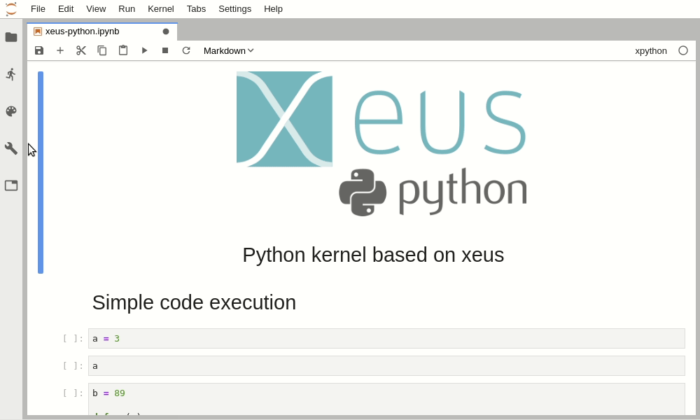
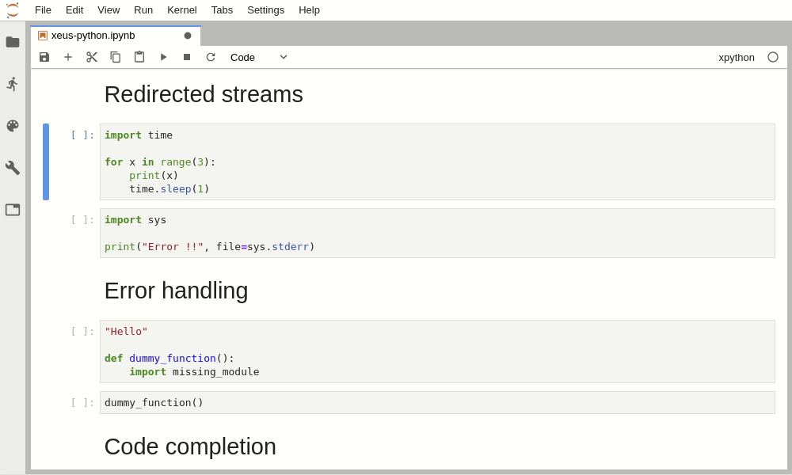
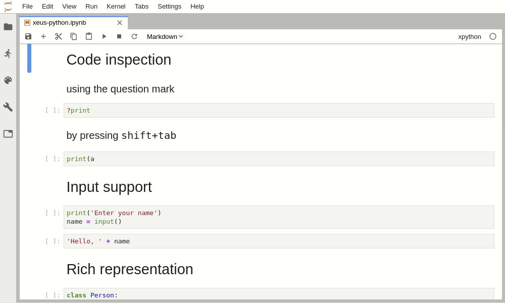
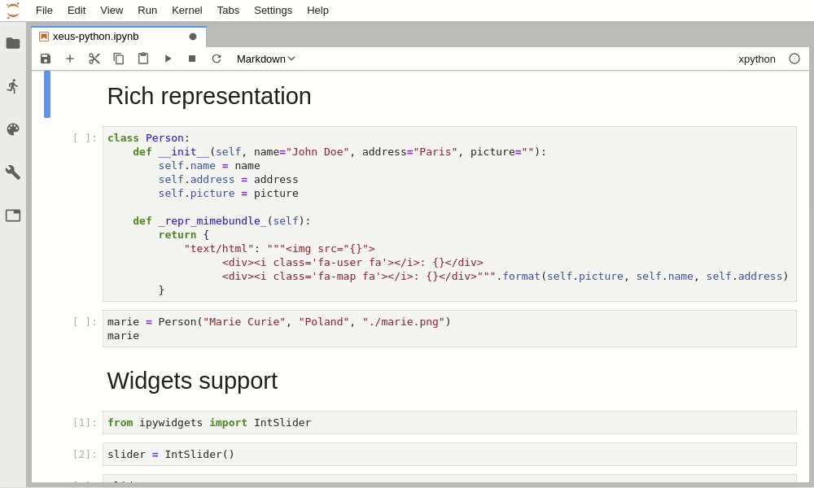

# 

[](https://travis-ci.org/QuantStack/xeus-python)
[](https://ci.appveyor.com/project/QuantStack/xeus-python)
[](https://xeus-python.readthedocs.io/en/latest/?badge=latest)
[](https://mybinder.org/v2/gh/QuantStack/xeus-python/stable?filepath=notebooks/xeus-python.ipynb)
[](https://gitter.im/QuantStack/Lobby?utm_source=badge&utm_medium=badge&utm_campaign=pr-badge&utm_content=badge)

`xeus-python` is a Jupyter kernel for Python based on the native implementation of the Jupyter protocol [xeus](https://github.com/QuantStack/xeus).

## Usage

Launch the Jupyter notebook with `jupyter notebook` or Jupyter lab with `jupyter lab` and launch a new Python notebook by selecting the **xpython** kernel.

**Code execution and variable display**:



**Output streams**:



**Input streams**:


**Error handling**:


**Inspect**:



**Code completion**:


**Rich display**:



**And of course widgets**:


## Installation

xeus-python has been packaged for the conda package manager.

To ensure that the installation works, it is preferable to install `xeus-python` in a fresh conda environment. It is also needed to use a [miniconda](https://conda.io/miniconda.html) installation because with the full [anaconda](https://www.anaconda.com/) you may have a conflict with the `zeromq` library which is already installed in the anaconda distribution.


The safest usage is to create an environment named `xeus-python` with your miniconda installation

```bash
conda create -n xeus-python
conda activate xeus-python # Or `source activate xeus-python` for conda < 4.6
```

### Installation directly from conda

Then you can install in this environment `xeus-python` and its dependencies

```bash
conda install xeus-python notebook -c conda-forge
```

### Installation from source

Or you can install it from the sources, you will first need to install dependencies

```bash
conda install cmake xeus nlohmann_json cppzmq xtl pybind11 jedi pygments notebook -c conda-forge
```

Then you can compile the sources

```bash
cmake -D CMAKE_PREFIX_PATH=your_conda_path -D CMAKE_INSTALL_PREFIX=your_conda_path -D PYTHON_EXECUTABLE=`which python`
make && make install
```

## Trying it online

To try out xeus-python interactively in your web browser, just click on the binder
link:

[](https://mybinder.org/v2/gh/QuantStack/xeus-python/stable?filepath=notebooks/xeus-python.ipynb)

## Documentation

To get started with using `xeus-python`, check out the full documentation

http://xeus-python.readthedocs.io/

## What are the advantages of using xeus-python over ipykernel (IPython kernel)?

Check-out this blog post for the answer: https://blog.jupyter.org/a-new-python-kernel-for-jupyter-fcdf211e30a8.
Long story short:
xeus-python does not cover 100% of the features of ipykernel. For examples, IPython magics are not supported yet by xeus-python. However:

- xeus-python is a lot lighter than ipykernel and IPython combined, which makes it a lot easier to implement new features on top of it. Our next goal is to augment the protocol to implement a Python debugger in JupyterLab.
- xeus-based kernels are more versatile in that one can overload e.g. the concurrency model. This is something that Kitware’s SlicerJupyter project takes advantage of to integrate with the Qt event loop of their Qt-based desktop application.

## Dependencies

``xeus-python`` depends on

 - [xeus](https://github.com/QuantStack/xeus)
 - [xtl](https://github.com/QuantStack/xtl)
 - [pybind11](https://github.com/pybind/pybind11)
 - [nlohmann_json](https://github.com/nlohmann/json)


| `xeus-python`|   `xeus`        |      `xtl`      | `cppzmq` | `nlohmann_json` | `pybind11`      | `jedi`            | `pygments`        | `six`             |
|--------------|-----------------|-----------------|----------|-----------------|-----------------|-------------------|-------------------|-------------------|
|  master      |  >=0.22.0,<0.23 |  >=0.6.5,<0.7   | ~4.3.0   | >=3.6.1,<4.0    | >=2.2.4,<3.0    | >=0.13.3,<0.14.0  | >=2.3.1,<3.0.0    |                   |
|  0.4.0       |  >=0.22.0,<0.23 |  >=0.6.5,<0.7   | ~4.3.0   | >=3.6.1,<4.0    | >=2.2.4,<3.0    | >=0.13.3,<0.14.0  | >=2.3.1,<3.0.0    |                   |
|  0.3.2       |  >=0.21.1,<0.22 |  >=0.6.5,<0.7   | ~4.3.0   | >=3.6.1,<4.0    | >=2.2.4,<3.0    | >=0.13.3,<0.14.0  | >=2.3.1,<3.0.0    |                   |
|  0.3.1       |  >=0.21.1,<0.22 |  >=0.6.5,<0.7   | ~4.3.0   | >=3.6.1,<4.0    | >=2.2.4,<3.0    | >=0.13.3,<0.14.0  | >=2.3.1,<3.0.0    |                   |
|  0.3.0       |  >=0.21.1,<0.22 |  >=0.6.5,<0.7   | ~4.3.0   | >=3.6.1,<4.0    | >=2.2.4,<3.0    | >=0.13.3,<0.14.0  | >=2.3.1,<3.0.0    |                   |
|  0.2.2       |  >=0.19.2,<0.20 |  >=0.6.4,<0.7   | ~4.3.0   | >=3.6.1,<4.0    | >=2.2.4,<3.0    | >=0.13.3,<0.14.0  | >=2.3.1,<3.0.0    |                   |
|  0.2.1       |  >=0.18.1,<0.19 |  >=0.5.2,<0.6   | ~4.3.0   | >=3.3.0,<4.0    | >=2.2.4,<3.0    | >=0.13.1,<0.14.0  | >=2.3.1,<3.0.0    |                   |
|  0.2.0       |  >=0.18.1,<0.19 |  >=0.5.2,<0.6   | ~4.3.0   | >=3.3.0,<4.0    | >=2.2.4,<3.0    | >=0.13.1,<0.14.0  | >=2.3.1,<3.0.0    |                   |
|  0.1.5       |  >=0.18.1,<0.19 |  >=0.5.2,<0.6   | ~4.3.0   | >=3.3.0,<4.0    | >=2.2.4,<3.0    | >=0.13.1,<0.14.0  | >=2.3.1,<3.0.0    |                   |
|  0.1.4       |  >=0.18.1,<0.19 |  >=0.5.2,<0.6   | ~4.3.0   | >=3.3.0,<4.0    | >=2.2.4,<3.0    | >=0.13.1,<0.14.0  | >=2.3.1,<3.0.0    |                   |
|  0.1.3       |  >=0.18.1,<0.19 |  >=0.5.2,<0.6   | ~4.3.0   | >=3.3.0,<4.0    | >=2.2.4,<3.0    | >=0.13.1,<0.14.0  | >=2.3.1,<3.0.0    |                   |
|  0.1.2       |  >=0.18.1,<0.19 |  >=0.5.2,<0.6   | ~4.3.0   | >=3.3.0,<4.0    | >=2.2.4,<3.0    | >=0.13.1,<0.14.0  | >=2.3.1,<3.0.0    | >=1.12.0,<2.0.0   |
|  0.1.1       |  >=0.18.1,<0.19 |  >=0.5.2,<0.6   | ~4.3.0   | >=3.3.0,<4.0    | >=2.2.4,<3.0    | >=0.13.1,<0.14.0  | >=2.3.1,<3.0.0    |                   |
|  0.1.0       |  >=0.18.1,<0.19 |  >=0.5.2,<0.6   | ~4.3.0   | >=3.3.0,<4.0    | >=2.2.4,<3.0    | >=0.13.1,<0.14.0  | >=2.3.1,<3.0.0    |                   |
|  0.0.4       |  >=0.18.1,<0.19 |  >=0.5.2,<0.6   | ~4.3.0   | >=3.3.0,<4.0    | >=2.2.4,<3.0    | >=0.13.1,<0.14.0  |                   |                   |
|  0.0.3       |  >=0.17.0,<0.18 |  >=0.5.0,<0.6   | ~4.3.0   | >=3.3.0,<4.0    | >=2.2.4,<3.0    | >=0.13.1,<0.14.0  |                   |                   |
|  0.0.2       |  >=0.16.0,<0.17 |  >=0.4.0,<0.5   | ~4.3.0   | >=3.3.0,<4.0    | >=2.2.4,<3.0    |                   |                   |                   |
|  0.0.1       |  >=0.15.0,<0.16 |  >=0.4.0,<0.5   | ~4.3.0   | >=3.3.0,<4.0    | >=2.2.4,<3.0    |                   |                   |                   |


## License

We use a shared copyright model that enables all contributors to maintain the
copyright on their contributions.

This software is licensed under the BSD-3-Clause license. See the [LICENSE](LICENSE) file for details.
