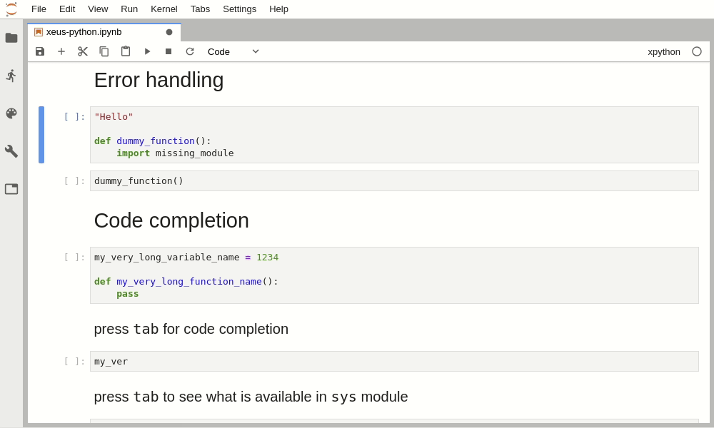

# 

[](https://github.com/jupyter-xeus/xeus-python/actions/workflows/main.yml)
[](https://xeus-python.readthedocs.io/en/latest/?badge=latest)
[](https://mybinder.org/v2/gh/jupyter-xeus/xeus-python/stable?urlpath=/lab/tree/notebooks/xeus-python.ipynb)
[](https://jupyter-xeus.github.io/xeus-python/)
[](https://jupyter.zulipchat.com)

`xeus-python` is a Jupyter kernel for Python based on the native implementation of the Jupyter protocol [xeus](https://github.com/jupyter-xeus/xeus).

## Installation

xeus-python has been packaged for the mamba (or conda) package manager.

To ensure that the installation works, it is preferable to install `xeus-python` in a fresh environment. It is also needed to use a [miniforge](https://github.com/conda-forge/miniforge#mambaforge) or [miniconda](https://conda.io/miniconda.html) installation because with the full [anaconda](https://www.anaconda.com/) you may have a conflict with the `zeromq` library which is already installed in the anaconda distribution.

The safest usage is to create an environment named `xeus-python`

```bash
mamba create -n xeus-python
source activate xeus-python
```

### Installing from conda-forge

Then you can install in this environment `xeus-python` and its dependencies

```bash
mamba install xeus-python notebook -c conda-forge
```

### Installing from PyPI

Depending on the platform, PyPI wheels may be available for xeus-python.

```bash
pip install xeus-python notebook
```

If you encounter the following error message

```bash
Collecting xeus-python
  Cache entry deserialization failed, entry ignored
  Could not find a version that satisfies the requirement xeus-python (from versions: )
No matching distribution found for xeus-python
```

you probably need to upgrade pip: `pip install --upgrade pip` before attempting to install
`xeus-python` again.

The wheels uploaded on PyPI are **experimental**. In general we strongly recommend using a
package manager instead. We maintain the conda-forge package, and nothing prevents you from
creating a package your favorite Linux distribution or FreeBSD.

The ongoing effort to package xeus-python for pip takes place in the [xeus-python-wheel](https://github.com/jupyter-xeus/xeus-python-wheel) repository.

### Installing from source

Or you can install it from the sources, you will first need to install dependencies

```bash
mamba install cmake xeus xeus-zmq nlohmann_json pybind11 pybind11_json xeus-python-shell jupyterlab -c conda-forge
```

Then you can compile the sources (replace `$CONDA_PREFIX` with a custom installation prefix if need be)

```bash
mkdir build && cd build
cmake .. -D CMAKE_PREFIX_PATH=$CONDA_PREFIX -D CMAKE_INSTALL_PREFIX=$CONDA_PREFIX -D CMAKE_INSTALL_LIBDIR=lib -D PYTHON_EXECUTABLE=`which python`
make && make install
```

## Trying it online

To try out xeus-python interactively in your web browser, just click on the binder
link:

[](https://mybinder.org/v2/gh/jupyter-xeus/xeus-python/stable?urlpath=/lab/tree/notebooks/xeus-python.ipynb)

## Usage

Launch the Jupyter notebook with `jupyter notebook` or Jupyter lab with `jupyter lab` and launch a new Python notebook by selecting the **xpython** kernel.

**Raw mode**

You can run xeus-python in the "raw" mode by selecting the `XPython Raw` kernel. In this mode:

- IPython is not used: IPython magics are not available
- Jupyter console is not supported

but

- xeus-python starts faster
- Completion/Inspection/Code execution works faster
- Interactive widgets are supported

This is useful when using xeus-python in [Voila](https://github.com/voila-dashboards/voila), where you should see a
~15% performance improvement, reducing the load of your application.

## xeus-python in JupyterLite!

You can install xeus-python in JupyterLite, see https://github.com/jupyterlite/xeus for more information.

**Code execution and variable display**:


**Output streams**:


**Input streams**:


**Error handling**:



**Inspect**:


**Code completion**:


**Rich display**:


**And of course widgets**:


## Documentation

To get started with using `xeus-python`, check out the full documentation

http://xeus-python.readthedocs.io

## What are the advantages of using xeus-python over ipykernel (IPython kernel)?

Check-out this blog post for the answer: https://blog.jupyter.org/a-new-python-kernel-for-jupyter-fcdf211e30a8.
Long story short:

- xeus-python is a lot lighter than ipykernel, which makes it a lot easier to implement new features on top of it.
- xeus-python already works with the **Jupyter Lab debugger**: https://github.com/jupyterlab/jupyterlab/tree/main/packages/debugger
- xeus-based kernels are more versatile in that one can overload e.g. the concurrency model. This is something that Kitware’s SlicerJupyter project takes advantage of to integrate with the Qt event loop of their Qt-based desktop application.

## Dependencies

``xeus-python`` depends on

 - [xeus-zmq](https://github.com/jupyter-xeus/xeus-zmq)
 - [pybind11](https://github.com/pybind/pybind11)
 - [pybind11_json](https://github.com/pybind/pybind11_json)
 - [nlohmann_json](https://github.com/nlohmann/json)
 - [xeus-python-shell](https://github.com/jupyter-xeus/xeus-python-shell)

| `xeus-python`|   `xeus-zmq`     |`nlohmann_json` | `pybind11`     | `pybind11_json`   | `pygments`        | `debugpy` |`xeus-python-shell` |
|--------------|------------------|----------------|----------------|-------------------|-------------------|-----------|--------------------|
|  main        |  >=3.1,<4.0      |>=3.11.3        | >=2.6.1,<3.0   | >=0.2.8,<0.3      | >=2.3.1,<3.0.0    | >=1.1.0   | >=0.6.3.0,<0.7.0   |
|  0.17.1      |  >=3.1,<4.0      |>=3.11.3        | >=2.6.1,<3.0   | >=0.2.8,<0.3      | >=2.3.1,<3.0.0    | >=1.1.0   | >=0.6.3.0,<0.7.0   |
|  0.17.0      |  >=3.0,<4.0      |>=3.11.3        | >=2.6.1,<3.0   | >=0.2.8,<0.3      | >=2.3.1,<3.0.0    | >=1.1.0   | >=0.6.3.0,<0.7.0   |

Prior vo version 0.17, ``xeus-python`` was also depending on [xtl](https://github.com/xtensor-stack/xtl) & [cppzmq](https://github.com/zeromq/cppzmq):

| `xeus-python`|   `xeus-zmq`     |      `xtl`      | `cppzmq` | `nlohmann_json` | `pybind11`     | `pybind11_json`   | `pygments`        | `debugpy` |`xeus-python-shell` |
|--------------|------------------|-----------------|----------|-----------------|----------------|-------------------|-------------------|-----------|---------------------|
|  0.16.x      |  >=1.0.0,<2.0    |  >=0.7.0,<0.8   | ~4.4.1   | >=3.6.1,<3.10   | >=2.6.1,<3.0   | >=0.2.8,<0.3      | >=2.3.1,<3.0.0    | >=1.1.0   | >=0.5.0,<0.7.0      |
|  0.15.x      |  >=1.0.0,<2.0    |  >=0.7.0,<0.8   | ~4.4.1   | >=3.6.1,<3.10   | >=2.6.1,<3.0   | >=0.2.8,<0.3      | >=2.3.1,<3.0.0    | >=1.1.0   | >=0.5.0,<0.7.0      |

Prior to version 0.15, ``xeus-python`` was depending on ``xeus`` instead of ``xeus-zmq``:

| `xeus-python`|   `xeus`         |      `xtl`      | `cppzmq` | `nlohmann_json` | `pybind11`     | `pybind11_json`   | `pygments`        | `debugpy` |`xeus-python-shell` |
|--------------|------------------|-----------------|----------|-----------------|----------------|-------------------|-------------------|-----------|---------------------|
|  0.14.3      |  >=2.0.0,<3.0    |  >=0.7.0,<0.8   | ~4.4.1   | >=3.6.1,<3.10   | >=2.6.1,<3.0   | >=0.2.8,<0.3      | >=2.3.1,<3.0.0    | >=1.1.0   | >=0.5.0,<0.6.0      |
|  0.14.2      |  >=2.0.0,<3.0    |  >=0.7.0,<0.8   | ~4.4.1   | >=3.6.1,<3.10   | >=2.6.1,<3.0   | >=0.2.8,<0.3      | >=2.3.1,<3.0.0    | >=1.1.0   | >=0.4.1,<0.5.0      |
|  0.14.1      |  >=2.0.0,<3.0    |  >=0.7.0,<0.8   | ~4.4.1   | >=3.6.1,<3.10   | >=2.6.1,<3.0   | >=0.2.8,<0.3      | >=2.3.1,<3.0.0    | >=1.1.0   | >=0.4.1,<0.5.0      |
|  0.14.0      |  >=2.0.0,<3.0    |  >=0.7.0,<0.8   | ~4.4.1   | >=3.6.1,<3.10   | >=2.6.1,<3.0   | >=0.2.8,<0.3      | >=2.3.1,<3.0.0    | >=1.1.0   | >=0.4.1,<0.5.0      |
|  0.13.x      |  >=2.0.0,<3.0    |  >=0.7.0,<0.8   | ~4.4.1   | >=3.6.1,<3.10   | >=2.6.1,<3.0   | >=0.2.8,<0.3      | >=2.3.1,<3.0.0    | >=1.1.0   | >=0.3.0,<0.4.0      |

## Contributing

See [CONTRIBUTING.md](./CONTRIBUTING.md) to know how to contribute and set up a development environment.

## License

We use a shared copyright model that enables all contributors to maintain the
copyright on their contributions.

This software is licensed under the BSD-3-Clause license. See the [LICENSE](LICENSE) file for details.
