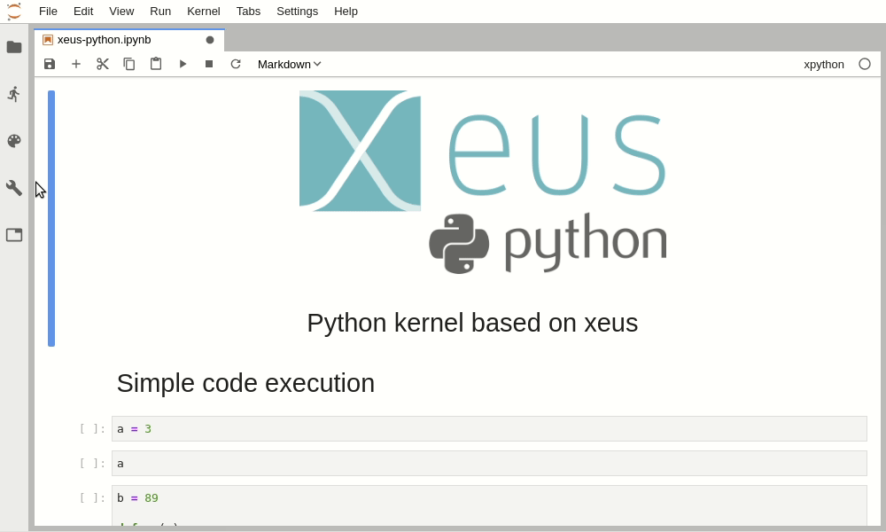
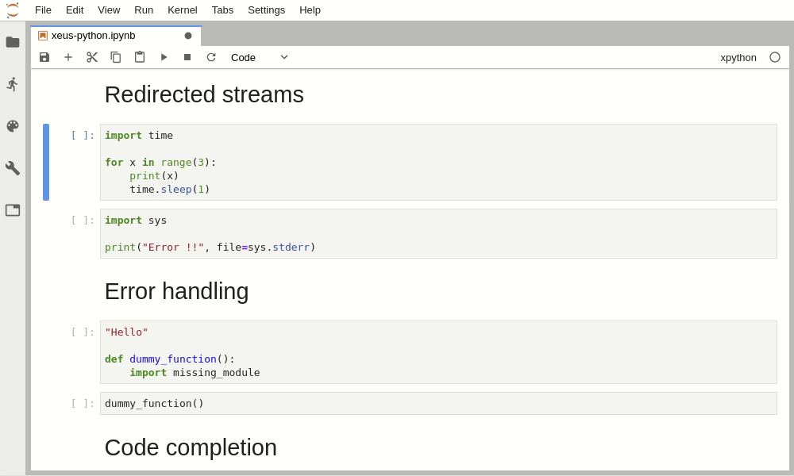
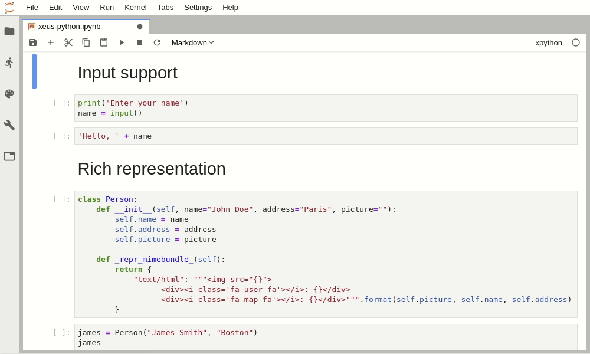
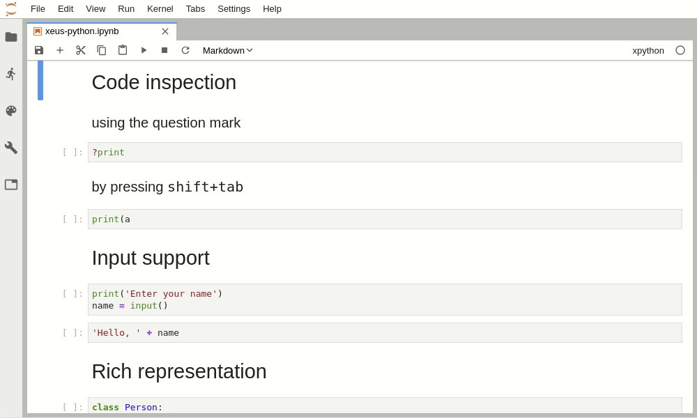
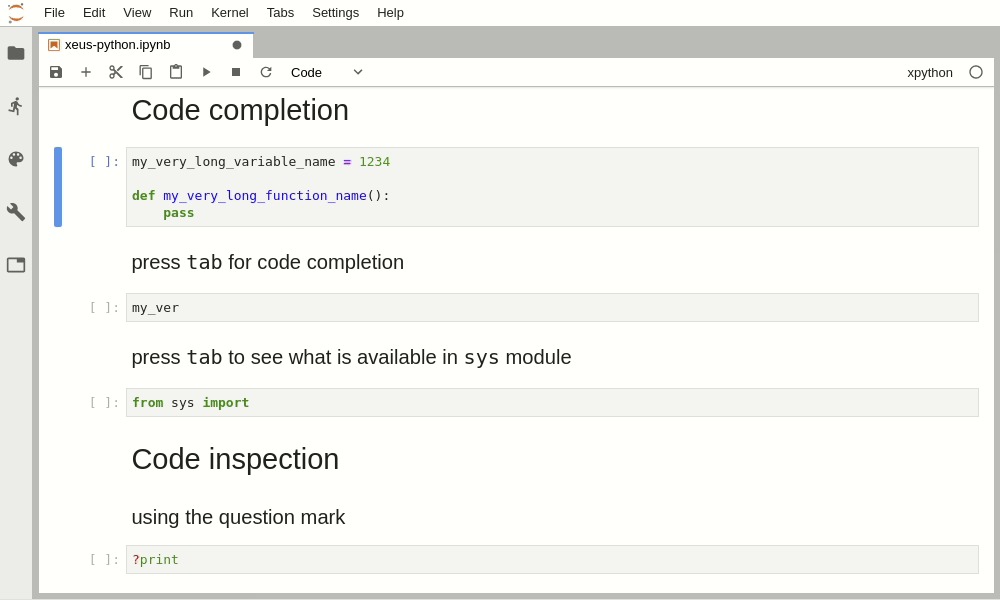
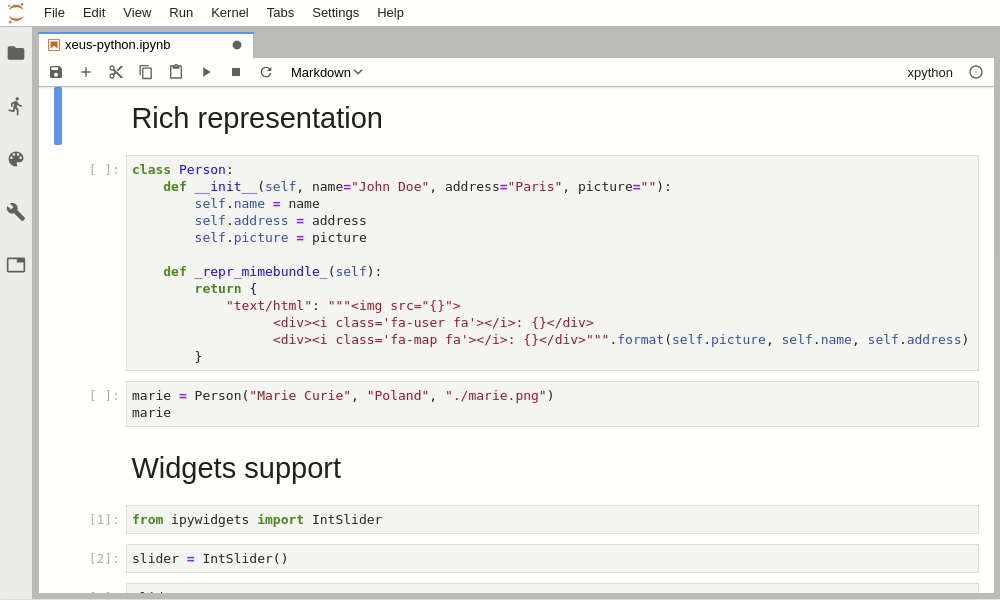
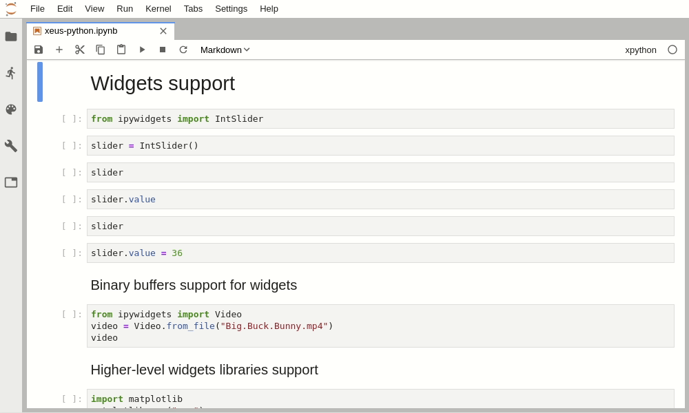
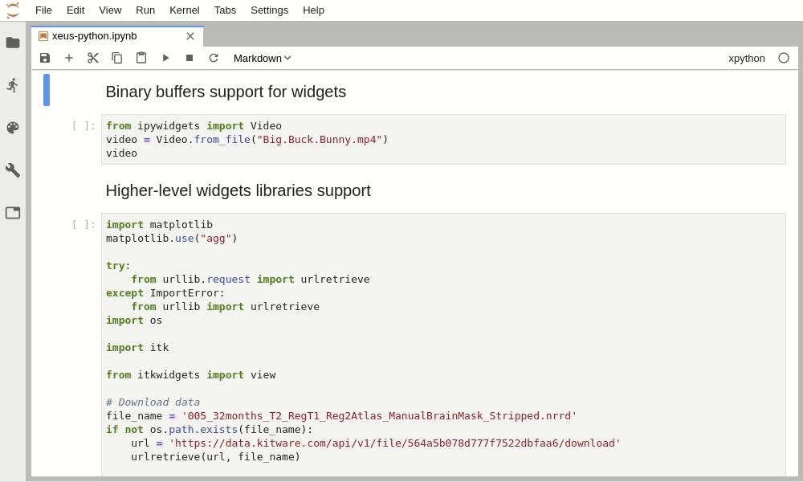

# Usage

Launch the Jupyter notebook with `jupyter notebook` or Jupyter lab with `jupyter lab` and launch
a new Python notebook by selecting the **xpython** kernel.

## Code execution and variable display

## Output streams

## Input streams

## Error handling

## Inspect

## Code completion

## Rich display

## And of course widgets

